<p align="center">
  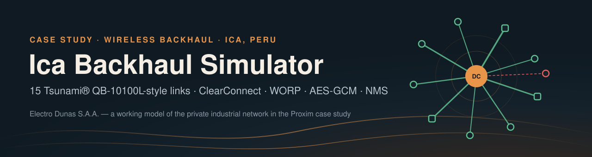
</p>

<p align="center">
  
  
  
  
  
</p>

<p align="center">
  <a href="#-quick-start">Quick start</a> ·
  <a href="#-what-it-models">What it models</a> ·
  <a href="#-architecture">Architecture</a> ·
  <a href="#-results">Results</a> ·
  <a href="#-dashboard">Dashboard</a> ·
  <a href="#-the-story">Story</a> ·
  <a href="#-assumptions--limits">Assumptions</a> ·
  <a href="#-team">Team</a>
</p>

---

**Ica Backhaul Simulator** is a working model of the network described in Proxim Wireless's case study ***"Securing High-Capacity Network Backhaul in Ica: Electro Dunas Deploys Tsunami® 10100L Radios."***

Electro Dunas distributes electricity in southern Peru. It connects its offices and thermal power plants to a single data center over **15 point-to-point radio links** in the 5 GHz band. The case study credits four things for making that work: interference mitigation (ClearConnect), a proprietary polling protocol (WORP), layered security, and hardware rated for Ica's desert heat and dust.

Real radios can't run in a repository. Instead, this project rebuilds each of those mechanisms in software and then **measures** what each one contributes.

<table>
<tr>
<td width="33%" valign="top">

**🛰️ Simulation engine**<br>
All 15 links stepped minute by minute: link budget, interference, the ClearConnect control loop, DFS radar, heat, dust and prioritised traffic.

</td>
<td width="33%" valign="top">

**🖥️ NMS dashboard**<br>
A live web console in the style of ProximVision Advanced: topology, KPIs, alarms, event log, plus buttons to inject faults and attacks.

</td>
<td width="33%" valign="top">

**📊 Experiments**<br>
Six reproducible experiments with charts, a link-budget table and a JSON summary, regenerated with one command.

</td>
</tr>
<tr>
<td colspan="3" valign="top">

**📖 Story**: *Fifteen Links Over Ica*, a scroll-driven telling of the case study that runs a TypeScript port of the engine live in the page. See [the story](#-the-story).

</td>
</tr>
</table>

## 🚀 Quick start

```bash
git clone https://github.com/ftaakash/IcaBackhaul.git && cd IcaBackhaul
pip install -r requirements.txt

python run.py                        # dashboard → http://127.0.0.1:8000
python -m pytest                     # 26 tests, ~5 s
python scripts/run_experiments.py    # regenerate results/ (~90 s)
```

<details>
<summary><b>Serve the dashboard over HTTPS (TLS 1.2+ only)</b></summary>

The case study's IT mandate requires certificate-secured device management. The dashboard can enforce the same rule:

```bash
python scripts/gen_cert.py              # self-signed ECDSA P-256 certificate → certs/
python run.py --tls --port 8443         # https://127.0.0.1:8443 — TLS 1.0 / 1.1 handshakes are refused
```
</details>

## 🧭 What it models

| Case-study claim | Module | How it is implemented |
|---|---|---|
| 15 PtP Tsunami QB-10100L links, offices and thermal plants → data center | [`config.py`](backhaul/config.py) · [`network.py`](backhaul/network.py) | 15 radio pairs from 1.8 to 13.8 km on one hub mast. 22 dBi antennas, switching to 28 dBi above 8 km. Site layout is **illustrative**. |
| Spectrum studies, tower and antenna sizing | [`rf.py`](backhaul/rf.py) | Free-space path loss, noise floor, earth bulge, 60 % first-Fresnel-zone clearance → required mast height per link. |
| Channel planning in a crowded 5 GHz band | [`spectrum.py`](backhaul/spectrum.py) · `Network.acs` | 37 × 20 MHz channels in U-NII-1/2A/2C/3. Third-party interferers switch on and off over time. Channels are chosen by worst-case **signal-to-interference ratio**, including leakage between radios on the same hub mast. |
| **ClearConnect** interference mitigation | `Network.step` | **ACS** (channel selection) at install · **DCS** (hop after 3 min of retries above 15 %) · **ATPC** (±1 dB steps within the EIRP limit) · **DDRS** (MCS 0–9 with 3 dB margin) · **HARQ** (retransmits only damaged frames) · **DFS** radar avoidance with a 30-minute channel ban. |
| **WORP** vs Wi-Fi MAC | [`mac.py`](backhaul/mac.py) | Monte Carlo CSMA/CA with exponential backoff and hidden nodes, against WORP's token-passing schedule. |
| Security mandate | [`security.py`](backhaul/security.py) · [`run.py`](run.py) | Challenge-response registration · HKDF session keys · **AES-256-GCM** with the header (VLAN id, sequence number) authenticated · replay rejection · **TLS 1.2+** management with a self-generated certificate. |
| Heat and desert dust | [`environment.py`](backhaul/environment.py) | SENAMHI 1991–2020 temperature normals for Ica, solar load on the enclosure, a 60 °C rating, *paracas* dust storms, heatwaves and sun shields. |
| ProximVision Advanced | [`nms.py`](backhaul/nms.py) · [`app/`](app) | Threshold alarms (link down, low SINR, retries, over-temperature, congestion) and an event log behind a REST API and web UI. |

## 🏗️ Architecture

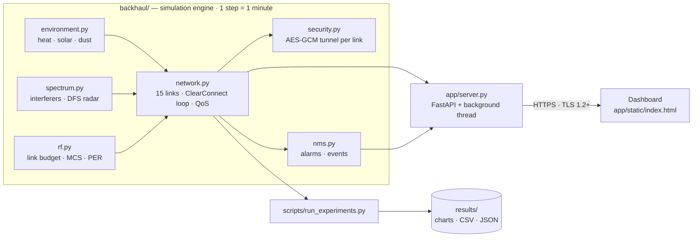

<details>
<summary><b>What happens to every link, every simulated minute</b></summary>

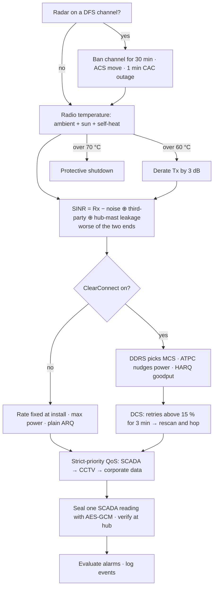
</details>

## 📊 Results

Every number below comes from `python scripts/run_experiments.py`. Runs are seeded, so re-running gives the same results. Raw values are in [`results/summary.json`](results/summary.json).

| # | Question | Finding |
|:-:|---|---|
| **E1** | What does channel width buy? | **137 / 324 / 633 Mbps** at 20 / 40 / 80 MHz, matching the datasheet. The 10100L's 320 Mbps licence fits in a 40 MHz channel. |
| **E2** | Why WORP instead of the Wi-Fi MAC? | WORP holds **75 %** useful airtime at any load. CSMA/CA falls from 55 % to 42 % at 50 stations, and to **27 %** when 30 % of station pairs can't hear each other. |
| **E3** | Does ClearConnect matter? | Mean link availability is **99.77 %** with ClearConnect against **85.07 %** for fixed-rate radios without channel hopping (7 days × 3 seeds). Delivered traffic is 614 vs 469 Mbps. |
| **E4** | Is Ica too hot for a 60 °C radio? | A normal March day peaks at **57.7 °C**. A +5 °C heatwave keeps the radio **218 minutes over spec**, and a sun shield brings the peak down to **52.4 °C**. |
| **E5** | How tall must the masts be? | **12.4 to 23.3 m**, from obstacle height + earth bulge + 0.6 × the first Fresnel zone ([`link_budget.csv`](results/link_budget.csv)). |
| **E6** | Is the 670 Mbps licence worth buying? | **Not on its own.** Fifteen radios on one mast already use almost every 40 MHz channel, so moving to 80 MHz lowers average capacity from **3872 to 3233 Mbps**. Adding 20 dB of isolation at the hub (for example a second mast) raises it to **4243 Mbps**. |

<table>
<tr>
<td>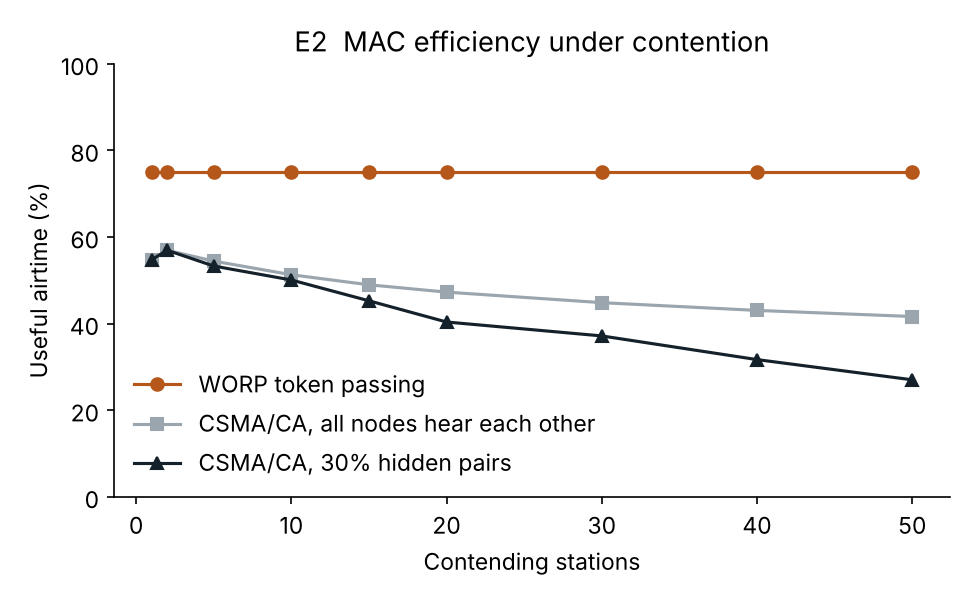<br><sub><b>E2</b> · Token passing stays flat while CSMA/CA collapses as contention and hidden nodes grow.</sub></td>
<td>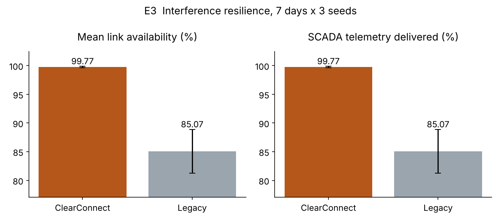<br><sub><b>E3</b> · Adaptive rate, power and channel keep links up through interference bursts.</sub></td>
</tr>
<tr>
<td>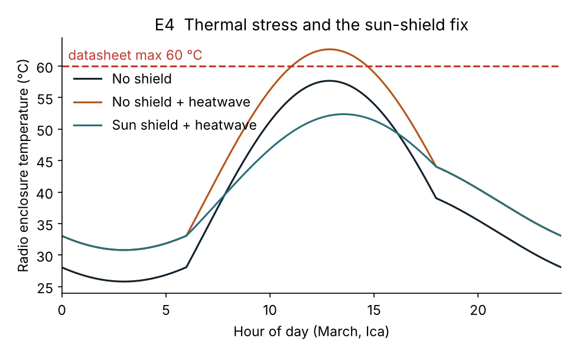<br><sub><b>E4</b> · In a heatwave the enclosure exceeds its rating; shading fixes it.</sub></td>
<td>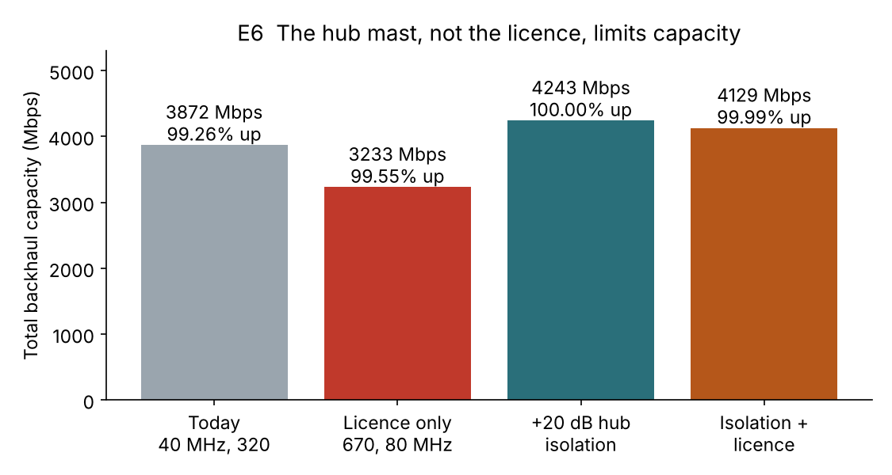<br><sub><b>E6</b> · The single hub mast, not the licence, is what limits capacity.</sub></td>
</tr>
<tr>
<td>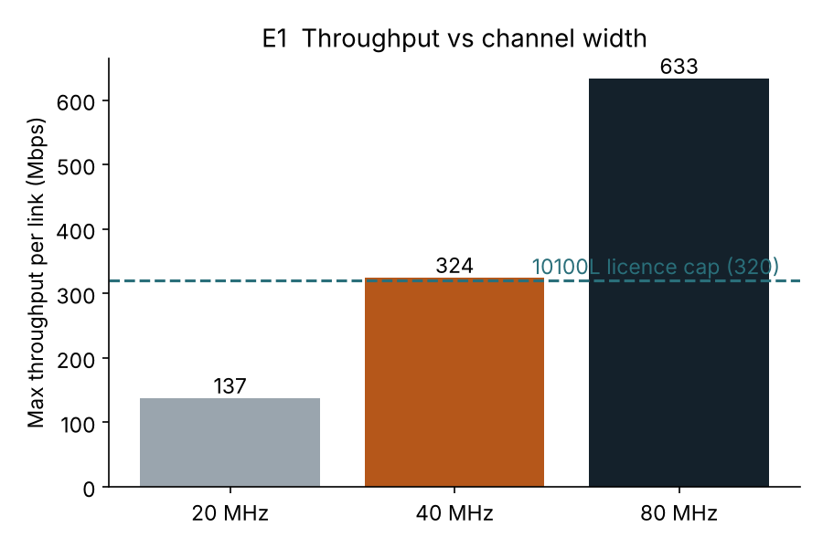<br><sub><b>E1</b> · Datasheet throughput by channel width, with the 320 Mbps licence cap.</sub></td>
<td>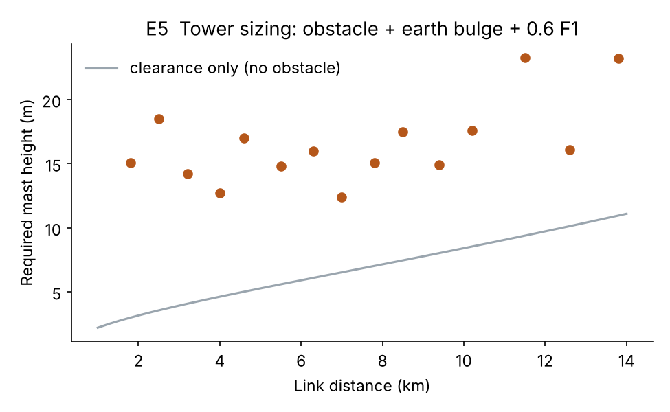<br><sub><b>E5</b> · Mast height needed for Fresnel clearance at each site.</sub></td>
</tr>
</table>

## 🖥️ Dashboard

<p align="center">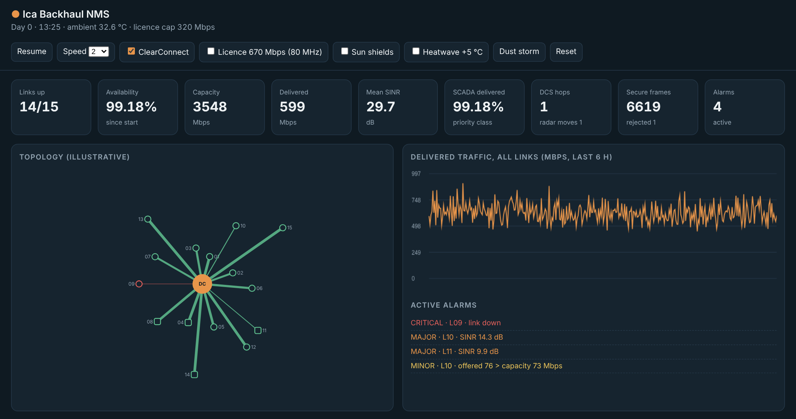</p>
<p align="center"><sub>Link 09 has just been hit by an injected interferer: the link shows red, a critical alarm fires, and DCS hops it to a clean channel within three minutes. A tampered frame on link 04 was rejected by AES-GCM authentication.</sub></p>

| Control | What it demonstrates |
|---|---|
| **ClearConnect** toggle | Switches between adaptive radios and fixed-rate legacy behaviour while the simulation runs |
| **Licence 670 Mbps (80 MHz)** | Re-plans channels so short links can move to 80 MHz where a clean slot exists |
| **Sun shields** · **Heatwave** · **Dust storm** | Ica's environmental stresses |
| **Interfere** (per link) | Adds a strong co-channel interferer, then watch DCS react |
| **Tamper** (per link) | Flips one bit in the next encrypted frame, which is rejected and logged |

<details>
<summary><b>REST API</b></summary>

| Method | Path | Description |
|---|---|---|
| `GET` | `/api/state` | Full network state: KPIs, per-link metrics, alarms, events, history |
| `POST` | `/api/control` | `{"action": "...", "value": ..., "link_id": ...}` — actions: `pause`, `resume`, `speed`, `step`, `clearconnect`, `licence`, `sun_shield`, `heatwave`, `dust_storm`, `interfere`, `tamper`, `reset` |
| `GET` | `/api/link-budget` | Clear-sky link budget and required mast height for every link |
| `GET` | `/health` | Liveness probe |
</details>

<details>
<summary><b>Full dashboard screenshot</b></summary>
<p align="center">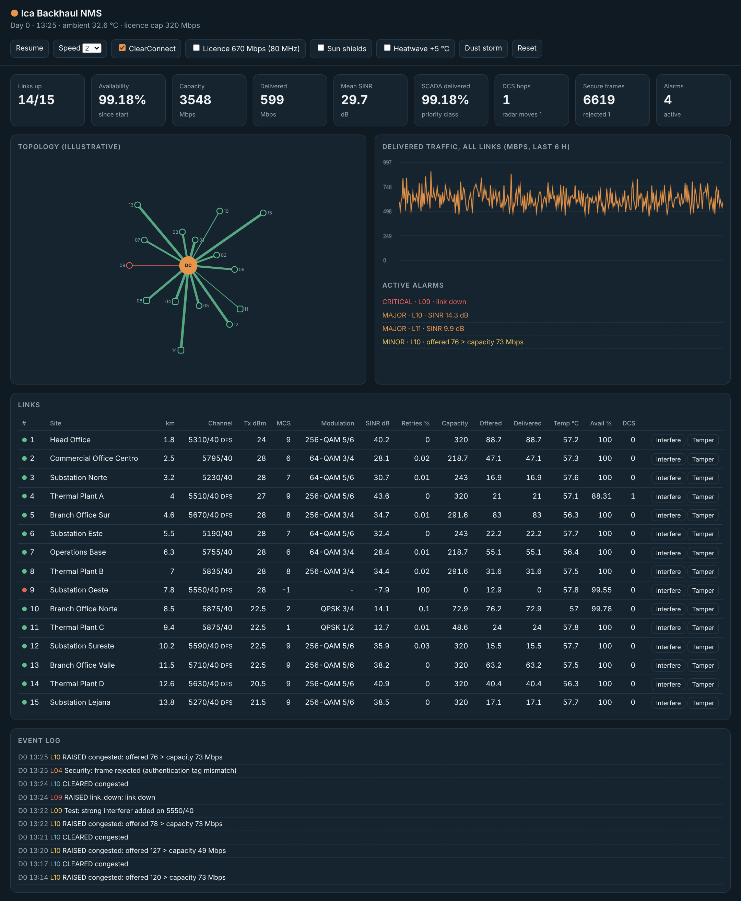</p>
</details>

## 📖 The story

[`story/`](story) holds **Fifteen Links Over Ica**, a scroll-driven story of the deployment told in fourteen chapters: Ica, the utility, the crowded band, the radio choice, tower sizing, ClearConnect, WORP, security, heat, the outcome and the next limit. As the reader scrolls, a sticky stage changes to a new live visualisation for each chapter.

- **One file, no server.** Open [`story/dist/fifteen-links-over-ica.html`](story/dist/fifteen-links-over-ica.html) in a browser.
- **Live, not recorded.** The network, spectrum and channel hops come from [`engine.ts`](story/src/engine/engine.ts), a line-for-line port of `backhaul/`. The reader can jam a link, switch ClearConnect off, seal and tamper with a real AES-256-GCM frame, and toggle a heatwave or sun shield.
- **Every number is sourced.** Each figure is tagged *Reported*, *Measured*, *Datasheet*, *Simulated* or *Live model*. The *Simulated* charts read [`results/`](results) directly.
- **Checked against Python.** Mean availability is 99.68 % vs 99.77 % with ClearConnect and 85.40 % vs 85.07 % without (7 days × 3 seeds). Path loss, mast heights and the heat curve match exactly (`pnpm run validate`).

```bash
cd story && pnpm install && pnpm run build   # → story/dist/fifteen-links-over-ica.html
```

## 🔐 Security model

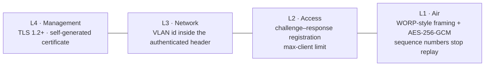

Framing on its own is **not** a security control. Confidentiality and integrity come from AES-GCM, with the frame header passed as associated data. As a result, moving a frame to a different VLAN or replaying it fails authentication. The tests in [`tests/test_mac_security.py`](tests/test_mac_security.py) check each of these cases.

## 📏 Assumptions & limits

> [!NOTE]
> These choices are stated up front so the results are read for what they are.

- **The site map is invented.** The case study confirms 15 links between offices, thermal plants and the data center but publishes no coordinates.
- **The physical layer is simplified.** It uses 2×2 VHT rates scaled to datasheet maximums, approximate SNR thresholds for each MCS, a logistic packet-error curve and 1 dB Gaussian fading.
- **Interference is synthetic.** Third-party interferers switch on and off as Markov sources. Leakage between radios on the same hub mast is modelled as 45 dB coupling loss plus 10–40 dB isolation depending on antenna bearings.
- **WORP is calibrated, not reverse-engineered.** Its efficiency matches Proxim's published 75 % figure. The CSMA/CA side is a genuine Monte Carlo simulation.
- **Cryptography is a modern stand-in.** HMAC-SHA256 replaces WORP's MD5-keyed secret. Proxim's sources disagree on AES key length (128 vs 256 bit); this code uses AES-256-GCM.
- **Dust is modelled as radome deposits.** In free air, dust barely affects 5 GHz signals, so a storm is modelled as 1–4 dB of deposit loss plus 0.05 dB/km.
- **The "legacy" baseline is a hypothesis.** Proxim did not publish what the old radios were.

## 🗂️ Project structure

```text
IcaBackhaul/
├── backhaul/                 simulation engine
│   ├── config.py             sites, radio parameters, Ica climate normals
│   ├── rf.py                 link budget, Fresnel clearance, MCS/PER tables
│   ├── spectrum.py           5 GHz channel plan, interferers, DFS radar
│   ├── environment.py        heat, solar load, dust storms
│   ├── security.py           registration, AES-GCM tunnel, replay protection
│   ├── mac.py                CSMA/CA vs WORP
│   ├── network.py            15-link engine + ClearConnect loop + QoS
│   └── nms.py                alarms and event log
├── app/                      FastAPI server + single-page dashboard
├── scripts/                  gen_cert.py · run_experiments.py
├── tests/                    pytest suite (26 tests)
├── results/                  generated charts, summary.json, link_budget.csv
├── docs/                     banner and screenshots
├── story/                    scroll-driven story + TypeScript engine port (React, Parcel)
└── run.py                    launcher (HTTP, or HTTPS with a TLS 1.2 floor)
```

## 🛠️ Development phases

The commit history follows the build order:

1. **Scaffold**: packaging, site and radio configuration
2. **RF engineering**: link budget, Fresnel clearance, MCS tables, tests
3. **Spectrum & environment**: 5 GHz channel plan, interferers, DFS, Ica climate
4. **Security**: secure transport and certificate tooling
5. **MAC layer**: WORP vs CSMA/CA, with security and MAC tests
6. **Network engine**: 15-link simulation, ClearConnect loop, NMS alarms
7. **Dashboard**: FastAPI backend, web UI, TLS launcher, integration tests
8. **Experiments**: reproducible results and charts
9. **Documentation**: this README, banner and screenshots
10. **Story**: *Fifteen Links Over Ica*, a scroll-driven story with a live TypeScript port of the engine

## 👥 Team

| Name | Registration |
|---|---|
| **Aakash G S** | RA2311042010060 |
| **Jaswanth** | RA2311042010013 |
| **Krishna P** | RA2311042010017 |

<sub>Department of Data Science, SRM Institute of Science and Technology.</sub>

## 📚 Sources

- Proxim Wireless — [*Case Study: Electro Dunas S.A.A., Peru*](https://proxim.com/resources/case-studies/electro-dunas-saa-peru/) ([PDF](https://proxim.com/wp-content/uploads/downloads/casestudies/proxim-wireless-cs-electro-dunas-saa.pdf))
- Proxim Wireless — *Tsunami® QB-10100 Series datasheet*; QB-10100L 320 / 670 Mbps licence tiers
- Proxim Wireless — [WORP®](https://proxim.com/technology/worp/) and [ClearConnect™](https://proxim.com/technology/proxim-clearconnect/) technology pages
- SENAMHI 1991–2020 climate normals for Ica, via [climate-zone.com](https://www.climate-zone.com/climate/pe/ica/)
